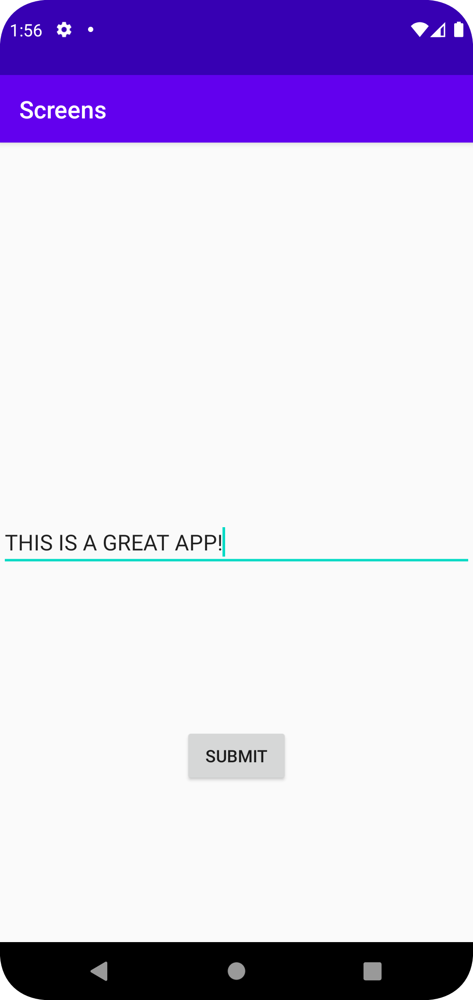
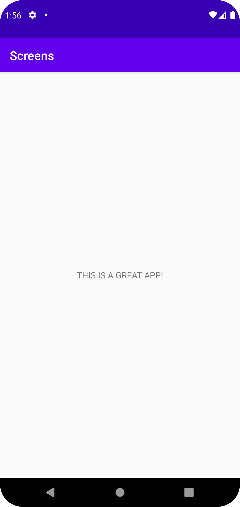

# Rapport

För att kunna lägga in text och visa den på en andra skärm behövs
en second activity och starta den med en intent. På första sidan ska 
text matas in och den ska sedan visas på andra skärmen.

EditText och Button views ligger i activity_main.xml filen där användaren
kan skriva in och skicka text.

    EditText editText = findViewById(R.id.editText);
    String text = editText.getText().toString();
    Intent intent = new Intent(MainActivity.this, SecondActivity.class);
    intent.putExtra("text", text);
    startActivity(intent);

Här tar vi texten som matats in i EditText och skickar med den till SecondActivity,
där den kan visas genom TextView.

SecondActivity startar när någon clickar på knappen:

    Button myButton = findViewById(R.id.btnStartSecondActivity);
    myButton.setOnClickListener(new View.OnClickListener() {...}

Första skärmen: \

Andra skärmen: \
